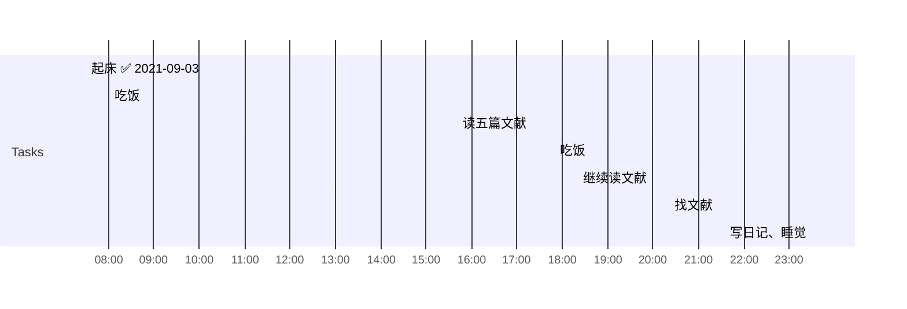

## Day Planner

** 这是2021-09-03的日计划**
 
***
 
### 上午
 
- [x] 07:30 起床 ✅ 2021-09-03
- [x] 08:00 吃饭

***

### 下午

- [ ] 15:40 读五篇文献
- [ ] 17:50 吃饭

***

### 晚上
- [ ] 18:20 继续读文献
- [ ] 20:20 找文献
- [ ] 23:30 写日记、睡觉

