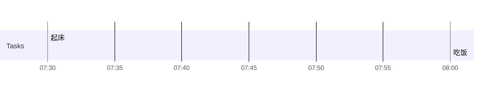

## Day Planner

```mermaid
gantt
    dateFormat  HH-mm
    axisFormat %H:%M
    %% Current Time: 下午3:11:33
    section Tasks
    起床     :07-30, 30mm
    吃饭     :08-00, 0mm
    section Breaks

```

** 这是{{date:YYYY-MM-DD}}的日计划**
 
***
 
### 上午
 
- [x] 07:30 起床
- [x] 08:00 吃饭

***

### 下午

***

### 晚上

